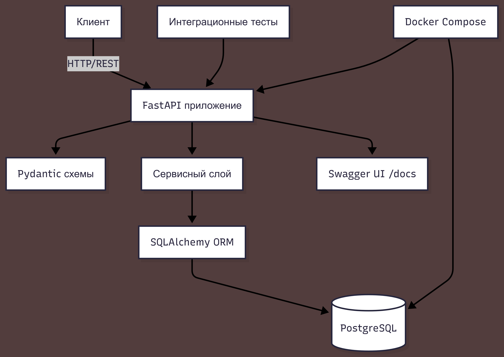

# API организационной структуры

REST API для управления организационной структурой компании: подразделения и сотрудники.

[](https://fastapi.tiangolo.com/)
[](https://www.postgresql.org/)
[](https://www.docker.com/)
[](https://pytest.org)

---

## ✨ Возможности
- CRUD для подразделений (создание, чтение, обновление, удаление)
- Древовидная структура с произвольной глубиной
- Сотрудники привязаны к подразделениям
- Валидация уникальности имени в пределах родителя
- Защита от циклических ссылок при перемещении
- Каскадное удаление или перенос сотрудников
- Автоматическая документация Swagger UI
- Полная контейнеризация (Docker Compose)
- Интеграционные тесты (pytest)

---

## 🏗️ Архитектура



---

## 📡 API Endpoints

| Метод | Путь | Описание |
|-------|------|----------|
| `POST` | `/departments/` | Создать подразделение |
| `GET` | `/departments/{id}` | Получить дерево подразделения |
| `PATCH` | `/departments/{id}` | Обновить подразделение |
| `DELETE` | `/departments/{id}` | Удалить подразделение |
| `POST` | `/departments/{id}/employees/` | Добавить сотрудника |

---

## 🚀 Быстрый старт

### 1. Клонирование репозитория
```bash
git clone https://github.com/bsekinaev/org-structure-api.git
cd org-structure-api
```

### 2. Создайте `.env` файл
```
DATABASE_URL=postgresql://postgres:postgres@db:5432/org_db
```

### 3. Запуск
```bash
docker-compose up --build -d
docker-compose exec app alembic upgrade head
```

Приложение доступно на `http://localhost:8000`.  
Swagger UI: `http://localhost:8000/docs`

---

## 🧪 Тесты
```bash
docker-compose exec app pytest
```

---

## 📁 Структура проекта
```
org-structure-api/
├── app/
│   ├── main.py          # FastAPI приложение
│   ├── models.py        # SQLAlchemy модели
│   ├── schemas.py       # Pydantic схемы
│   ├── services.py      # Бизнес-логика
│   └── database.py      # Подключение к БД
├── tests/
│   └── test_api.py      # Интеграционные тесты
├── alembic/             # Миграции
├── docker-compose.yml
├── Dockerfile
├── requirements.txt
└── README.md
```

---

## 🚧 Дальнейшее развитие

- [x] CRUD для подразделений и сотрудников
- [x] Древовидная структура с проверкой циклов
- [x] Каскадное удаление и перенос сотрудников
- [x] Интеграционные тесты (pytest)
- [x] Docker Compose и автодокументация
- [ ] Кэширование часто запрашиваемых деревьев (Redis)
- [ ] Пагинация для списков сотрудников
- [ ] Авторизация и разделение ролей (JWT)
- [ ] CI/CD (GitHub Actions)
- [ ] Экспорт структуры в CSV/JSON
- [ ] Логирование и мониторинг
- [ ] Фронтенд для визуализации дерева

---

## 👤 Автор
**Батраз Секинаев**  
Python Backend Developer  
📧 bsekinaev@ya.ru | 📢 [@bsekinaev](https://t.me/bsekinaev) | ⭐️ [GitHub](https://github.com/bsekinaev)


